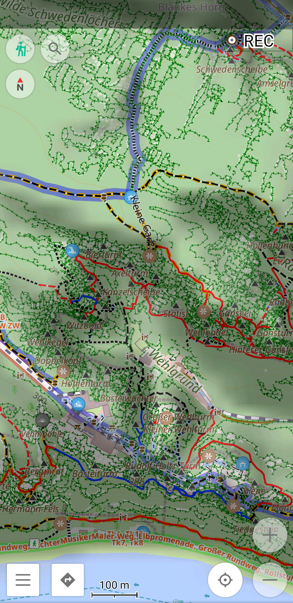
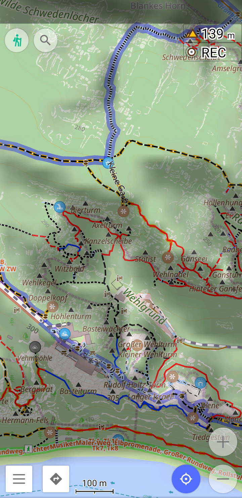

# OsmAnd-custom-render-xml
Custom map rendering options for https://github.com/osmandapp/OsmAnd.

## Installation

Copy `hiking.render.xml` to your phone (`<internal storage>/Android/data/net.osmand.plus/files/rendering/`)

## Option to hide cliffs

| OsmAnd touring map style | w/ my modification |
|--------------------|--------------------|
|  |  |
